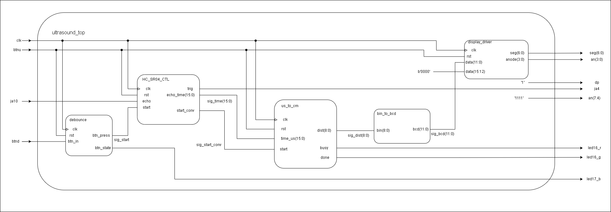
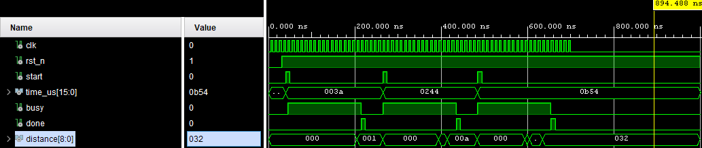
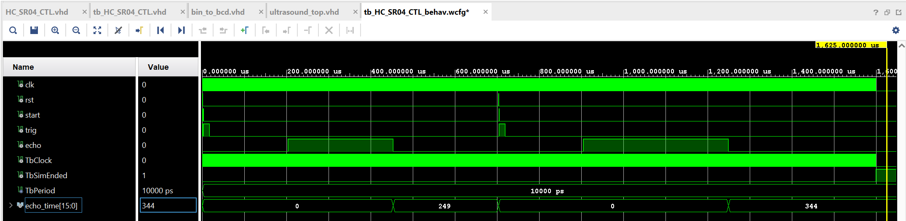
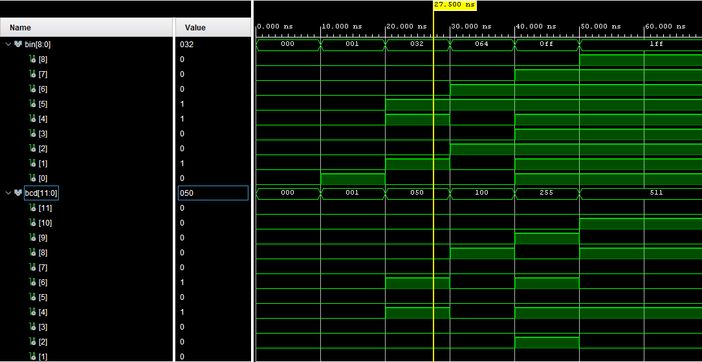
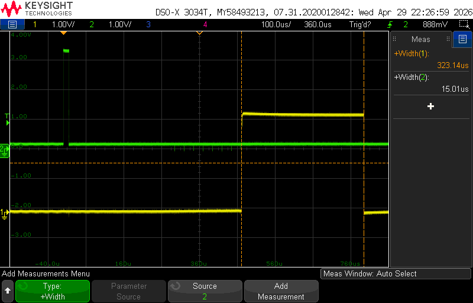

# Ultrazvukový měřič vzdálenosti – HC-SR04

Projekt v rámci předmětu digitální elektronika 1 - návrh na FPGA (Nexys A7 50).  
Měření vzdálenosti pomocí ultrazvukového senzoru HC-SR04 se zobrazením výsledku na 7-segmentovém displeji.

---

## Popis projektu

Zařízení vyšle ultrazvukový pulz pomocí senzoru HC-SR04, změří dobu návratu echa a vypočítá vzdálenost. Výsledek je zobrazen v centimetrech na 7-segmentovém displeji desky Nexys A7. Měření se spouští stiskem tlačítka.

### Indikace stavu pomocí LED

| LED | Barva | Popis |
|---|---|---|
| `led16_r` |  Červená | Probíhá měření (`busy`) |
| `led16_g` |  Zelená | Měření dokončeno (`done`) |
| `led17_b` |  Modrá | Tlačítko bylo stisknuto (`btn_state`) |

---

## Blokové schéma

### Moduly

| Modul | Popis |
|---|---|
| `debounce` | Odstraňuje zákmity tlačítka (`btnd`), generuje `btn_press` a `btn_state` |
| `HC_SR04_CTL` | Řídí senzor – generuje trigger pulz (`trig`), měří délku `echo`, výstup `echo_time(15:0)` a `start_conv` |
| `us_to_cm` | Přepočítá naměřený čas `time_us` na vzdálenost v cm, výstup `dist(8:0)`, signály `busy` a `done` |
| `bin_to_bcd` | Převede binární vzdálenost na BCD formát pro displej, výstup `bcd(11:0)` |
| `display_driver` | Zobrazuje naměřenou hodnotu na 7-segmentovém displeji (`seg(6:0)`, `anode(3:0)`) |

---

## Použitý hardware

- **FPGA deska:** Nexys A7 50 (Xilinx Artix-7)
- **Senzor:** HC-SR04 (ultrazvukový, rozsah 2–400 cm)
- **Level shifter** převod úrovní mezi HC-SR04 (5v) a FPGA (3v3)

---

## Vstupy a výstupy

| Signál | Směr | Popis |
|---|---|---|
| `clk` | vstup | Systémové hodiny |
| `btnu` | vstup | Reset |
| `btnd` | vstup | Spuštění měření |
| `ja10` | vstup | Echo signál ze senzoru HC-SR04 |
| `ja4` | výstup | Trigger pulz pro senzor HC-SR04 |
| `seg(6:0)` | výstup | Segmenty 7-segmentového displeje |
| `an(3:0)` | výstup | Anody 7-segmentového displeje |
| `dp` | výstup | Desetinná tečka (neaktivní) |
| `an(7:4)` | výstup | Horní anody (trvale vypnuto – `'1111'`) |
| `led16_r` | výstup | Červená LED – probíhá měření |
| `led16_g` | výstup | Zelená LED – měření dokončeno |
| `led17_b` | výstup | Modrá LED – tlačítko stisknuto |

---

## Simulace

### `us_to_cm`

Modul přepočítává dobu trvání echa v mikrosekundách na vzdálenost v centimetrech (dělení hodnotou 58). Simulace ověřuje tři testovací případy:
- `0x003a` (58 µs) → `0x001` (1 cm)
- `0x0244` (580 µs) → `0x00a` (10 cm)
- `0x0b54` (2900 µs) → `0x032` (50 cm)

Signál `busy` je aktivní po dobu výpočtu, `done` vydá jednoclockový pulz po dokončení.

---

### `HC_SR04_CTL`

Modul řídí komunikaci se senzorem HC-SR04 – generuje trigger pulz a měří délku echo signálu. Výstup `echo_time` udává naměřený čas v µs. Simulace ukazuje dvě měření:
- První echo → `echo_time = 249`
- Druhé echo → `echo_time = 344`

---

### `bin_to_bcd`

Kombinační modul převádí 9-bitové binární číslo na BCD formát (stovky, desítky, jednotky) pomocí algoritmu Double Dabble. Simulace ověřuje převod hodnot:
- `0x000` (0) → `000`
- `0x001` (1) → `001`
- `0x032` (50) → `050`
- `0x064` (100) → `100`
- `0x0ff` (255) → `255`
- `0x1ff` (511) → `511`

---

## Osciloskop

Screenshot z osciloskopu zachycující průběh trigger a echo signálů senzoru HC-SR04 při reálném měření na desce.

---

## Video demonstrace

[Spustit video](video.mp4)

Video ukazuje funkční zařízení – měření vzdálenosti s výsledkem na 7-segmentovém displeji a indikací stavu pomocí LED.

---

## Resource Report

> 
---

## Použité nástroje

- Xilinx Vivado 2025.2
- VHDL
- Claude

---

## Autoři

- **Daniel Viskup** – [HC_SR04_CTL, HC_SR04_CTL_tb, us_to_cm, ultrasound_top]
- **Vít Uhlíř** – [bin_to_bcd, bin_to_bcd_tb, dist_calc_tb, GitHub]

---

## Reference

- [HC-SR04 Datasheet](https://cdn.sparkfun.com/datasheets/Sensors/Proximity/HCSR04.pdf)
- [Nexys A7 Reference Manual](https://digilent.com/reference/programmable-logic/nexys-a7/reference-manual)
