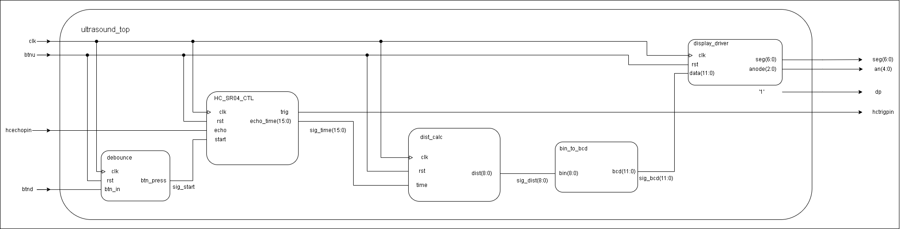

# Ultrazvukový měřič vzdálenosti – HC-SR04

Projekt v rámci předmětu digitální návrh na FPGA (Nexys A7 50).  
Měření vzdálenosti pomocí ultrazvukového senzoru HC-SR04 se zobrazením výsledku na 7-segmentovém displeji.

---

## Popis projektu

Zařízení vyšle ultrazvukový pulz pomocí senzoru HC-SR04, změří dobu návratu echa a vypočítá vzdálenost. Výsledek je zobrazen v centimetrech na 7-segmentovém displeji desky Nexys A7. Měření se spouští stiskem tlačítka.

---

## Blokové schéma

### Moduly

| Modul | Popis |
|---|---|
| `debounce` | Odstraňuje zákmity tlačítka (`btnd`), generuje čistý signál `btn_press` |
| `HC_SR04_CTL` | Řídí senzor – generuje trigger pulz, měří délku `echo`, výstup `echo_time(15:0)` |
| `dist_calc` | Přepočítá naměřený čas `echo_time` na vzdálenost v cm, výstup `dist(8:0)` |
| `bin_to_bcd` | Převede binární vzdálenost na BCD formát pro displej, výstup `bcd(11:0)` |
| `display_driver` | Zobrazuje naměřenou hodnotu na 7-segmentovém displeji (`seg`, `anode`) |

---

## Použitý hardware

- **FPGA deska:** Nexys A7 50 (Xilinx Artix-7)
- **Senzor:** HC-SR04 (ultrazvukový, rozsah 2–400 cm)

---

## Vstupy a výstupy

| Signál | Směr | Popis |
|---|---|---|
| `clk` | vstup | Systémové hodiny |
| `btnu` | vstup | Reset |
| `btnd` | vstup | Spuštění měření |
| `hcechopin` | vstup | Echo signál ze senzoru HC-SR04 |
| `hctrigpin` | výstup | Trigger pulz pro senzor HC-SR04 |
| `seg(6:0)` | výstup | Segmenty 7-segmentového displeje |
| `an(4:0)` | výstup | Anody 7-segmentového displeje |
| `dp` | výstup | Desetinná tečka (neaktivní) |

---

## Simulace

---

## Resource Report

---

## Použité nástroje

- Xilinx Vivado 2025.2
- VHDL

---

## Autoři

- **Daniel Viskup** – []
- **Vít Uhlíř** – []

---

## Reference

- [HC-SR04 Datasheet](https://cdn.sparkfun.com/datasheets/Sensors/Proximity/HCSR04.pdf)
- [Nexys A7 Reference Manual](https://digilent.com/reference/programmable-logic/nexys-a7/reference-manual)
